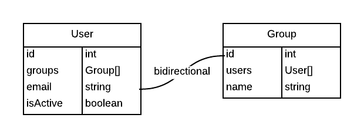

# SliDoctrineEntityDataMapperBundle [](https://travis-ci.org/sergeil/SliDoctrineEntityDataMapperBundle)

Bundle provides tools that simplify mapping data coming from client-side onto Doctrine ORM managed entities.

Features:
 * All basic scalar types mapping (boolean, numbers ...)
 * All types of associations are supported (+bidirectional aspect of relations is taken care of out of the box)
 * Complex data types transformation and mapping - when a value before being mapped onto an entity is transformed
 * Additional DI services injection to a setter method when a value is mapped
 * Flexible mapping of date/datetimes

## Teaser with ManyToMany relation

For an illustration purpose let's take a classical example of User and Group entities and assume that they are
bidirectionally linked to each other.



Now, let's take a look at several sample array data-structures that you may pass to EntityDataMapperService and
have it properly mapped data onto your entity. For the illustration purpose we assume that we have two users -
"Jane Doe" and "John Doe" with corresponding IDs of 1 and 2, and three groups: "Admins", "Users", "Moderators" with IDs
1, 2, 3.

```php
$em = $container->get('doctrine.orm.entity_manager');
$mapper = $container->get('sli_doctrine_entity_data_mapper.mapping.entity_data_mapper');

$adminsGroup = $em->find('MyBundle:Group', 1);
$usersGroup = $em->find('MyBundle:Group', 2);
$moderatorsGroup = $em->find('MyBundle:Group', 3);

$john = new User('John Doe');
$jane = new User('Jane Doe');

$userParams = array(
    'groups' => [1, 2]
);

$mapper->mapEntity($john, $userParams, array_keys($userParams));

$em->persist($john);
$em->persist($jane);
$em->flush();

echo count($john->groups); // two elements, groups "Admins" and "Users" were fetched from database by their IDs
echo count($adminGroup->users); // one element
echo count($usersGroup->users); // one element
echo count($moderatorsGroup->users); // zero elements
```

Now let's presume that during next request we want that $john user would belong only to "Moderators" group:

```php
$userParams = array(
    'groups' => [3]
);

$mapper->mapEntity($john, $userParams, array_keys($userParams));
```

Several things just happened:
 * "Admins" and "Users" group were removed from User's side Collection
 * "John Doe" was removed from "Admins" and "Users" Group's Collections
 * "John Doe" was added to "Moderators" group
 * "Moderators" group was added to John Doe's groups collection

## Installation

Add this dependency to your composer.json:

    "sergeil/doctrine-entity-data-mapper-bundle": "dev-develop"

Update your AppKernel class and add this:

    new Sli\DoctrineEntityDataMapperBundle\SliDoctrineEntityDataMapperBundle(),

## Documentation

TODO

## Licensing

This bundle is under the MIT license. See the complete license in the bundle:
Resources/meta/LICENSE